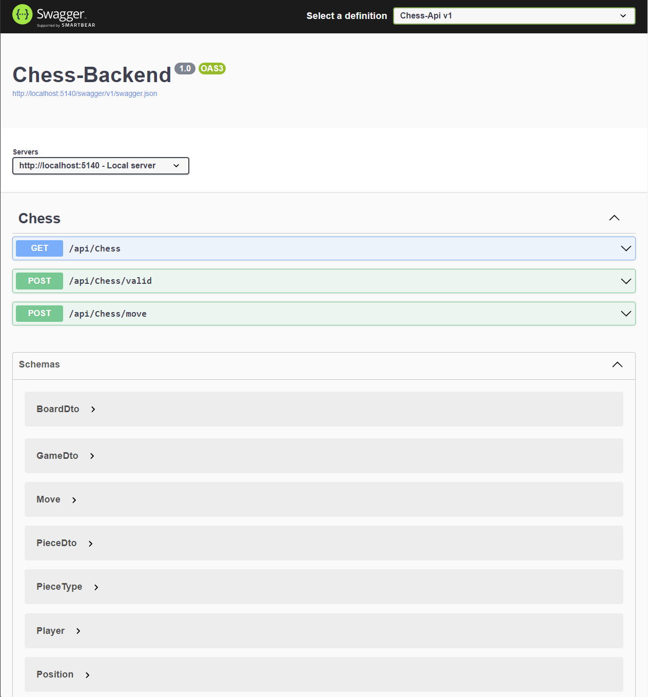
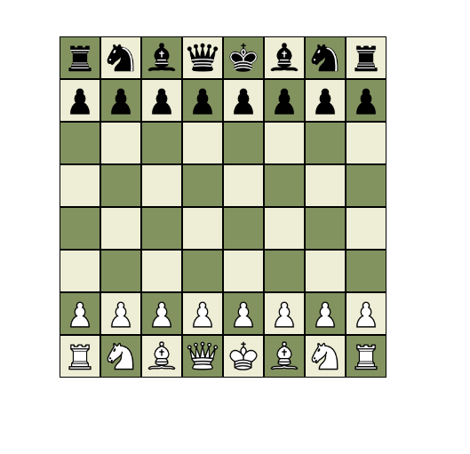
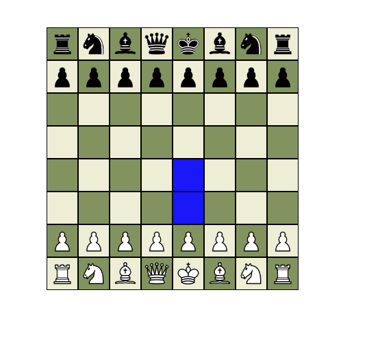

# Chess
This is a simple Chess application developed using a full-stack approach. The backend logic and web API are implemented in C#, while Angular is used for the frontend

The game logic is currently under development. The following features have been successfully implemented:

- Generation of possible moves for each piece
- Move validation, which only allows moves that do not put the king in check
- Check detection for the king
- 
However, certain special moves such as castling and pawn promotion are yet to be implemented.

## Backend
The backend part of the application is split into 2 projects:

- Library Project: This project contains the core logic for the Chess game. It encapsulates the rules, move generation, validation, and other game-specific functionalities
- Web API Project: This project handles API calls made by the frontend. It processes these requests, interacts with the library project as needed, and returns the appropriate responses

  

## Frontend
The frontend project is implemented using Angular. The code for accessing the DTOs and calling the controllers of the backend was generated using Swagger Gen.

Currently the frontend project contains:

- The web page displays the chess table with the pieces
- Once a piece is selected, the squares to which it can legally move are highlighted in a distinct color
- When a player’s king is in check or checkmate, a notification is displayed on the page

